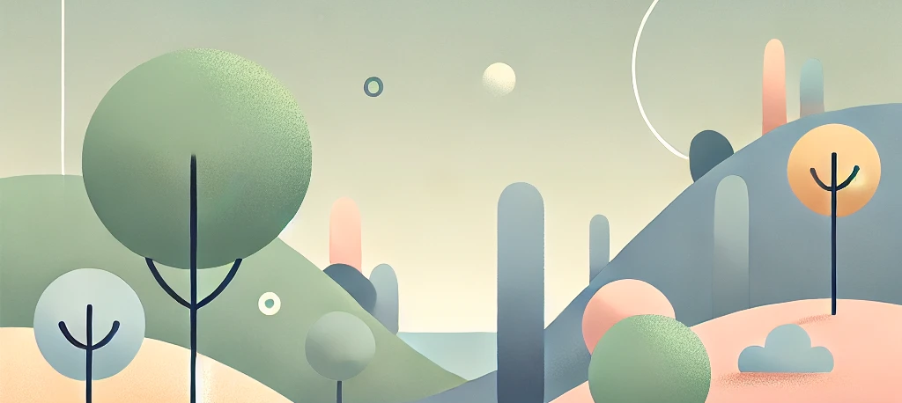

# QRitters

Welcome to **qritters**, the whimsical world where QR codes unlock amazing creatures! This app lets you scan random QR codes to discover unique and quirky creatures known as qritters. Each scan is an adventure, unlocking new and fascinating beings.

A hidden world of qritters surrounds you, waiting to be discovered. Each code you unlock brings you closer to completing your collection.

[Explore the Demo](https://www.qritters.app)

## Future Updates
- Flesh out qritter families, types, etc
- Add more qritters
- Support other barcode types
- Better UX and styling
